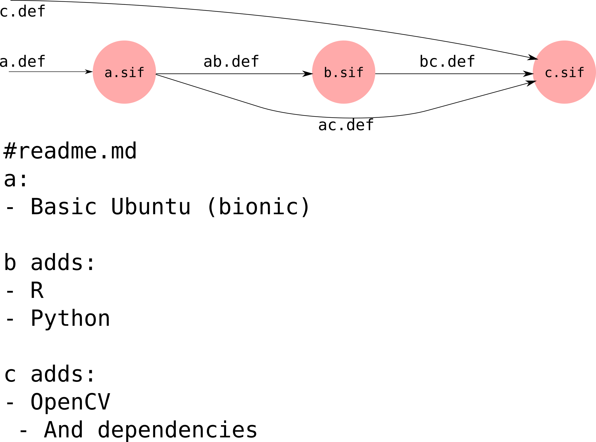

# Containers changelog

## a
- Installs Ubuntu (bionic)
- Installs basic libraries
- Installs gdal

## b
a+
- Required R packages
  - And dependencies

## c
b+
- OpenCV 4.1
  - And [dependencies](https://docs.opencv.org/4.1.0/d7/d9f/tutorial_linux_install.html)
- FORCE [dependencies](https://force-eo.readthedocs.io/en/latest/setup/depend.html)
## d
c+
- R packages needed for makeDataCube
- FORCE dependencies
- python packages needed for makeDataCube
## e
d+
- R makeDataCube package (commit 971bb08)
- FORCE 

## f
e+
- pylandsat for python 3 with dependences

## g
f+
- BenchmarkRecovery package (commit 060dffc)

# Naming convention

